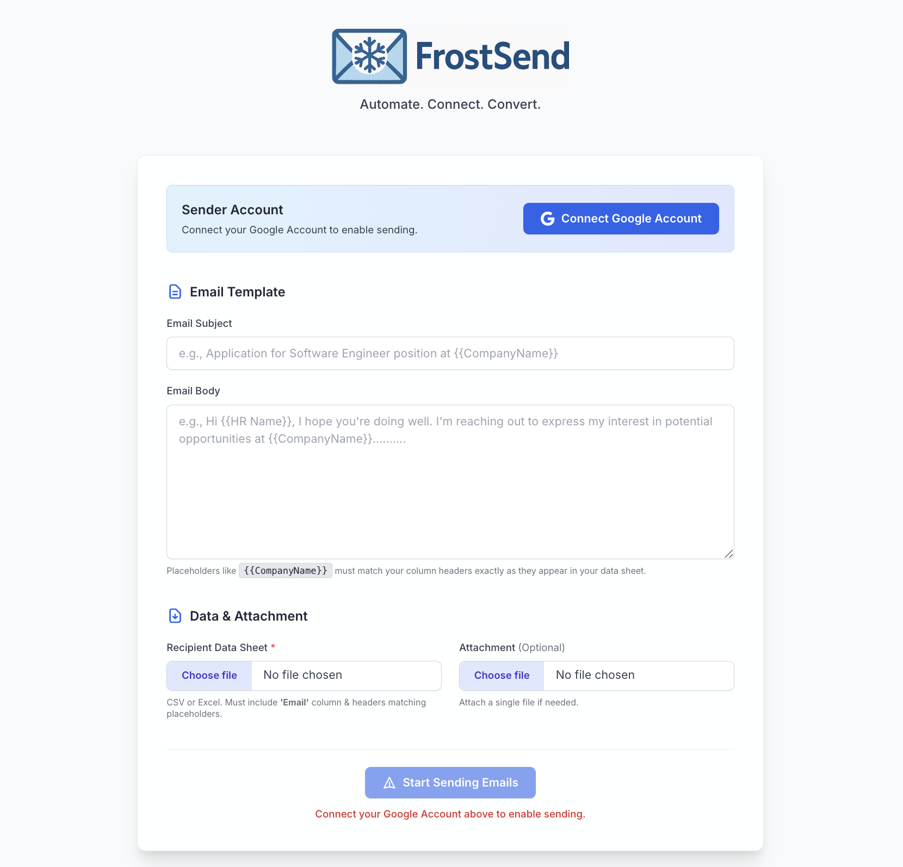

# FrostSend ❄️✉️

**Automate. Connect. Convert.**

FrostSend is a web application designed to streamline your cold email outreach campaigns by automating the process of sending personalized emails based on templates and recipient data from a spreadsheet.



## Overview

This application allows users to:
*   Securely connect their Google Account using OAuth 2.0.
*   Define email templates for the subject and body, using placeholders for personalization.
*   Upload a data sheet (CSV or Excel) containing recipient information, including email addresses and data for the template placeholders.
*   Optionally attach a file to be sent with all emails.
*   Send personalized emails automatically by iterating through the data sheet and replacing placeholders.

## Features

*   **Google OAuth 2.0 Integration:** Securely authenticate using your Google Account without sharing your password directly with the app.
*   **Template Engine:** Use `{{Column Name}}` placeholders in subject and body, matching headers in your data sheet.
*   **Data Sheet Upload:** Supports CSV and Excel (.xls, .xlsx) file formats.
*   **Optional Attachments:** Attach a single file to your email campaign.
*   **Session Persistence:** Remembers your email templates during your session.
*   **User-Friendly Error Handling:** Provides clearer feedback for common issues like invalid email formats.
*   **Modern UI:** Clean interface built with Flask and Tailwind CSS.

## Tech Stack

*   **Backend:** Python, Flask
*   **Frontend:** HTML, Tailwind CSS (via CDN)
*   **Email Sending:** Google Gmail API (via `google-api-python-client`)
*   **Authentication:** Google OAuth 2.0 (via `google-auth-oauthlib`)
*   **Data Handling:** Pandas, openpyxl

## Setup & Installation

1.  **Clone the repository (or download the code):**
    ```bash
    git clone https://github.com/mayurpatilll/FrostSend.git
    cd FrostSend
    ```

2.  **Install dependencies:**
    ```bash
    pip3 install -r requirements.txt
    # or use pip if pip3 is not your command
    # pip install -r requirements.txt 
    ```

3.  **Google Cloud Platform Setup:**
    *   Create a project on [Google Cloud Console](https://console.cloud.google.com/).
    *   Enable the **Gmail API**.
    *   Create **OAuth 2.0 Credentials** for a **Web application**.
    *   Configure **Authorized redirect URIs**: Add `http://127.0.0.1:5000/oauth2callback` (ensure this matches the `REDIRECT_URI` in `app.py`).
    *   Download the Client ID and Client Secret.

4.  **Set Environment Variables:** Before running the app, you **must** set the following environment variables in your terminal session:
    ```bash
    export GOOGLE_CLIENT_ID='YOUR_GOOGLE_CLIENT_ID_HERE'
    export GOOGLE_CLIENT_SECRET='YOUR_GOOGLE_CLIENT_SECRET_HERE'
    export FLASK_SECRET_KEY='YOUR_OWN_STRONG_SECRET_KEY' # Generate a strong random key
    # Optional, but recommended for local development to allow HTTP callback
    export OAUTHLIB_RELAX_TOKEN_SCOPE='1' 
    export OAUTHLIB_INSECURE_TRANSPORT='1' 
    ```
    *(Replace placeholders with your actual credentials and a generated secret key).*

5.  **Google OAuth Verification Prerequisites (Required for Public Use / Removing Unverified Screen):**
    *   **Create and Link Privacy Policy:**
        *   This is **Mandatory** for verification.
        *   You need a publicly accessible web page explaining how FrostSend handles user data.
        *   **Content should cover:**
            *   What data is accessed (permission to send email via user's account, user's email address).
            *   How data is used (sending emails composed by the user based on their template/sheet).
            *   How data is stored (OAuth credentials/templates in temporary session, uploaded files deleted after processing).
            *   A statement that the app adheres to the [Google API Services User Data Policy](https://developers.google.com/terms/api-services-user-data-policy).
        *   Host this policy (e.g., GitHub Pages, Google Sites, public Google Doc) and add the URL to the **"Application Privacy Policy link"** field in your Google Cloud OAuth consent screen settings.
    *   **Link Terms of Service (Optional but Recommended):**
        *   If you have Terms of Service, add the link in the OAuth consent screen settings. Less critical than the Privacy Policy for basic verification.

6.  **Run the application:**
    ```bash
    python3 app.py
    ```

7.  **Access the application in your browser at `http://127.0.0.1:5000`.

## Usage

1.  **Connect Account:** Click the "Connect Google Account" button and follow the Google authentication flow. You may see an "unverified app" screen if the app hasn't gone through Google's review process – you can bypass this if you trust the source (yourself, in this case).
2.  **Fill Template:** Enter your desired Email Subject and Email Body. Use placeholders like `{{Column Name}}` where you want data from your sheet inserted (e.g., `{{FirstName}}`, `{{CompanyName}}`). These must exactly match the headers in your data sheet.
3.  **Upload Data Sheet:** Choose your CSV or Excel file containing recipient data. Ensure it has an 'Email' column and columns matching any placeholders used in your template.
4.  **Upload Attachment (Optional):** Choose a file to attach to the emails.
5.  **Send Emails:** Click "Start Sending Emails". The application will process the sheet and send emails via your connected Google Account.
6.  **Review Status:** Check the flash messages at the top for success/error counts and details.

## Important Notes

*   **Google Verification:** As this app uses sensitive scopes (sending email), Google displays an "unverified app" warning during authentication unless the app undergoes Google's verification process. For personal use or trusted users, bypassing this warning is generally okay.
*   **Rate Limiting:** Sending large volumes of email quickly directly via Gmail API can lead to temporary rate limits from Google. Consider adding delays for large campaigns.
*   **Security:** Ensure your `FLASK_SECRET_KEY` is kept secret and strong. Do not commit your Google Client Secret directly into code.

## License

MIT License 